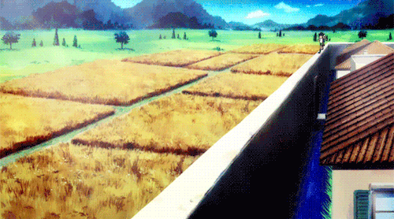

<body>
<h1 align="center"> ⬇️ 𝙒𝙚𝙡𝙘𝙤𝙢𝙚 𝙩𝙤 𝙢𝙮 𝙥𝙧𝙤𝙛𝙞𝙡𝙚 ⬇️ </h1>
 

 

<h2 align="center"> 💬 𝘼𝙗𝙤𝙪𝙩 𝙢𝙚 🗨️ </h2>

<li>
<b>Name:</b> Andrew</li>
<li>
<b>Gender:</b> Male
</li>
<li>
<b>Hobby:</b> Tech stuff, design, drawing, web development, anime, DnD
</li>
 

<b>     Thanks for reading about my personal stuff 
                                 💯❤️‍🔥</b>

<h2 align="left">            📇 𝙆𝙣𝙤𝙬𝙡𝙚𝙙𝙜𝙚/ 𝙆𝙣𝙤𝙬𝙣 𝙖𝙗𝙤𝙪𝙩 📇</h2>

      
    

 

I'm mostly program on <b><i>C, Python</i></b> and sometimes on <b><i>Java</i></b> I'm similar with <b>PHP, NodeJS</b> and lot of other programming languages

 

<h2 align="center">⌨️ 𝙒𝙤𝙧𝙠 𝙀𝙭𝙥𝙚𝙧𝙞𝙚𝙣𝙘𝙚 🖱️</h2>

 
 
 
I used take part as a <i><ins>SOC L1 engineer</ins></i> at <b><strong>OZON Tech</strong></b> in Internship Program

 
<h2 align="right">📝 𝘾𝙤𝙣𝙩𝙖𝙘𝙩 𝙢𝙚 📝            </h2>

 

Here are some of my   
most used social info ヽ(o＾▽＾o)ノ

<a href="https://t.me/l1mpex" target="_blank">Telegram</a>

 

 
   
   
   

    <h2 align ="center">⚔️ Stats 𝙇𝙀𝙑𝙀𝙇 𝙐𝙋! 🛡️</h2>
    
     
    
     
     
     
     
     
     
    

 
 
 
 
 
 
 
 
 
 
 
 
 
 
 

<h2 align="center">💖 𝙏𝙝𝙖𝙣𝙠𝙨 𝙛𝙤𝙧 𝙬𝙖𝙡𝙠𝙞𝙣𝙜 𝙩𝙝𝙧𝙤𝙪𝙜𝙝 𝙢𝙮 𝙥𝙧𝙤𝙛𝙞𝙡𝙚! 💖</h2>

</body>
